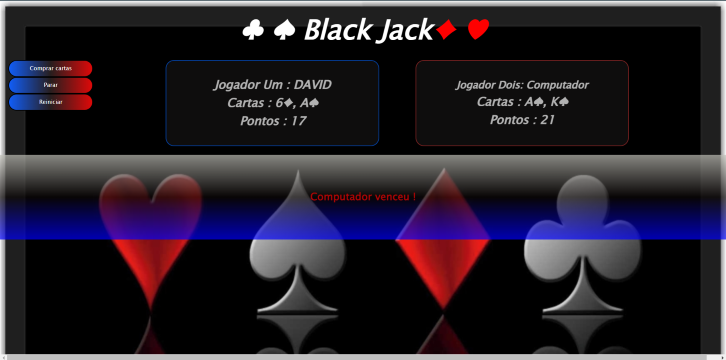
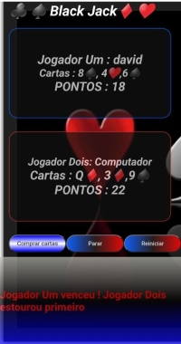

# Game_Black-Jack
## Olá!  

### Este Projeto foi feito com intuito de fixar e  aprimorar habilidades em :
 - JavaScript.

O projeto criado em JavaScript , estilizado com CSS e  feito em HTML  com manipulaçao DOM. 
 
Aparentimente projeto simples mas que demanda uma lógica complexa!

### Tela Desktop 

### Responsivo !

## Regras do jogo 
- Dois jogadores (Usuário e Computador);
- Cada jogador começa com duas cartas;
- O Usuário poderá comprar;
- O Computador também comprará cartas;
- O primeiro a fazer 21 ganha a rodada;
- O jogador que passar de 21 pontos perderá caso o outro jogador estiver com menos pontos;

## Como jogar 
- O jogo inicia quando o usuário clica em "OK" no confirm;
- Insira um nome para jogar;
- Você e o Computador receberá duas cartas; 
- Para comprar cartas clique no botão "Comprar cartas"
- Para para jogo clique em "Para jogo"
- se o usuário clicar em "cancelar" o jogo terminar.

## Obrigado pela atenção e se puder compartilhar sua crítica comigo, entre em contato! 